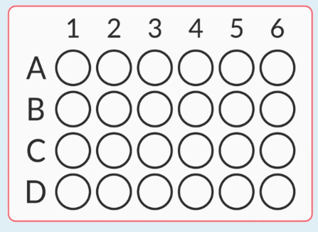
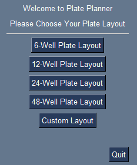
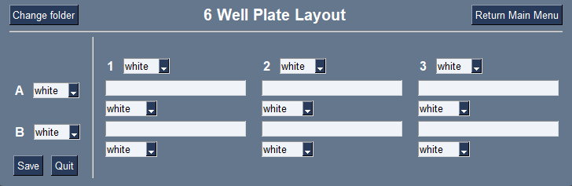
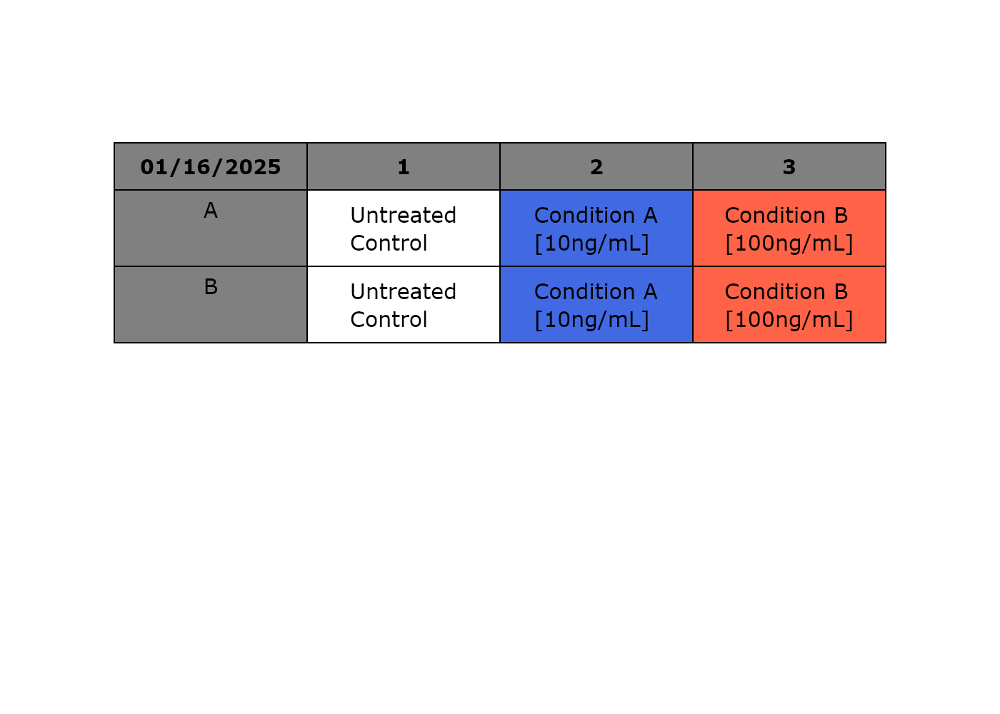

# Plate-Planner


Plate Planner allows the creation of a picture table to keep track of your experiment layouts on different plates.
<br />
<br />

# Installation

## About PySimpleGUI

Since version 5, PySimpleGUI has a free (Hobbyist) and paid (Commercial) option. 

Visit [PySimpleGUI GitHub](https://github.com/PySimpleGUI/PySimpleGUI) for more information and account creation. 

## Executable Option

For Windows users, an executable with PyInstaller was made. 
Download and unzip the file in the "Executable" folder.

Run .exe file.

## Individual Files

Download the "src" folder and generate a command file to open with Python version 3.12.2.

Install the dependencies in the version mentioned in the 'requirements.txt'

An example script on Windows would look like the following:
```
call activate env
python main.py
```

In both cases, please don't move the location of the files.

# How to use

Once opening Plate Planner, choose one of the default plate layouts.

If choosing the Custom Layout, indicate the number of rows and columns for your layout.



After selecting your layout, you can write the condition of each well.

If needed, you can change the background color of each well. 
Changing the color under the row letter or the column number will change the color of all the rows or columns, respectively.

If any well is left empty, an NA will be added to the output.



## Saving Layout

After adding all the information, clicking "Save" will create a table. The date of creation will be recorded in the table itself.

The file will be named the same as the chosen layout or "Custom Layout".

If a previous layout exists in the saving location with the same name, it will be overwritten.



## Changing saving folder

By default, the images will be saved in the exact location where the program is. 

If you want to save it in a different location, click "Change folder" to select a new location.


